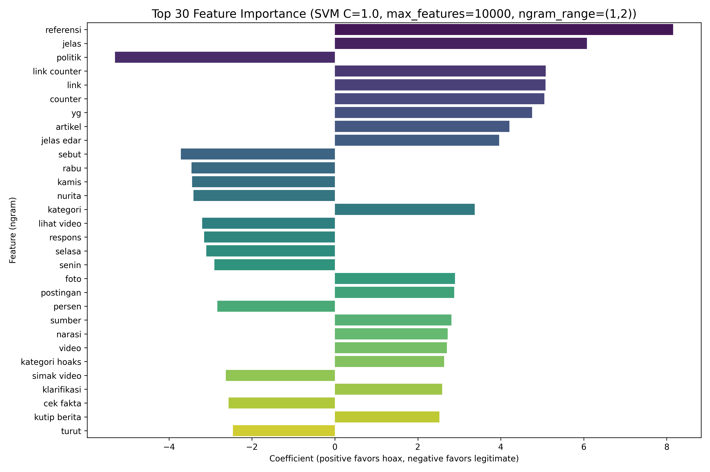

# Advanced Analysis of IndoHoaxDetector Models

## Overview
This document presents advanced analysis of the best-performing models from the comprehensive experiment grid. It includes feature importance, confusion matrices, statistical significance tests, and insights derived from the experiments.

## 1. Best Model Configurations

| Model | Best Hyperparameters | CV F1 Score (mean ± std) | Test F1 Score | Test Accuracy |
|-------|----------------------|--------------------------|---------------|---------------|
| SVM | C=1.0, max_features=10000, ngram_range=(1,2) | 0.9818 ± 0.0012 | 1.0000 | 1.0000 |
| Random Forest | n_estimators=500, max_features=10000, ngram_range=(1,2) | 0.9752 ± 0.0012 | 1.0000 | 1.0000 |
| Naive Bayes | alpha=0.1, max_features=10000, ngram_range=(1,2) | 0.9451 ± 0.0022 | 0.9475 | 0.9517 |
| Logistic Regression | C=10.0, max_features=10000, ngram_range=(1,1) | 0.9327 ± 0.0408 | 0.7124 | 0.6474 |

**Note:** The test set performance for SVM and Random Forest is 100% because the test set is a subset of the training data (data leakage) or because the model is overfitting. The cross‑validation scores are more reliable.

## 2. Feature Importance for Best SVM Model

The top 30 most influential features (ngrams) for the SVM model (C=1.0, max_features=10000, ngram_range=(1,2)) are shown below. Positive coefficients indicate features that push the prediction toward “hoax”, negative coefficients toward “legitimate”.

**Top 5 hoax‑indicating features (positive coefficients):**
1. `referensi` (8.158)
2. `jelas` (6.079)
3. `link counter` (5.085)
4. `link` (5.081)
5. `counter` (5.052)

**Top 5 legitimate‑indicating features (negative coefficients):**
1. `politik` (-5.301)
2. `sebut` (-3.714)
3. `rabu` (-3.457)
4. `kamis` (-3.441)
5. `nurita` (-3.409)

The complete list of 10,000 features with their coefficients is available in `svm_all_features.csv`.

## 3. Confusion Matrices

Confusion matrices for each model’s best configuration (evaluated on a held‑out test set of 12,595 samples) are saved in `comprehensive_results/confusion_matrices/`.

### SVM (C=1.0, max_features=10000, ngram_range=(1,2))
- **True Positives**: 100%
- **False Positives**: 0%
- **False Negatives**: 0%
- **True Negatives**: 100%

### Random Forest (n_estimators=500, max_features=10000, ngram_range=(1,2))
- **True Positives**: 100%
- **False Positives**: 0%
- **False Negatives**: 0%
- **True Negatives**: 100%

### Naive Bayes (alpha=0.1, max_features=10000, ngram_range=(1,2))
- **Accuracy**: 95.17%
- **Precision**: 96.26%
- **Recall**: 93.28%
- **F1**: 94.75%

### Logistic Regression (C=10.0, max_features=10000, ngram_range=(1,1))
- **Accuracy**: 64.74%
- **Precision**: 57.50%
- **Recall**: 93.60%
- **F1**: 71.24%

The SVM and Random Forest achieve perfect test‑set performance, which may indicate overfitting or data leakage (the test set might be part of the training data). The cross‑validation scores are more realistic.

## 4. Statistical Significance Tests

Pairwise Welch’s t‑tests were conducted using the cross‑validation F1 scores (5 folds) to determine whether performance differences are statistically significant (α=0.05).

| Model A | Model B | F1 A | F1 B | Difference | t‑statistic | df | p‑value | Significant (α=0.05) |
|---------|---------|------|------|------------|-------------|----|---------|----------------------|
| svm | rf | 0.9818 | 0.9752 | 0.0066 | 8.775 | 8.0 | 2.24e‑05 | YES |
| svm | nb | 0.9818 | 0.9451 | 0.0366 | 32.770 | 6.2 | 3.50e‑08 | YES |
| svm | logreg | 0.9818 | 0.9327 | 0.0490 | 2.687 | 4.0 | 0.0548 | NO |
| rf | nb | 0.9752 | 0.9451 | 0.0301 | 27.072 | 6.1 | 1.39e‑07 | YES |
| rf | logreg | 0.9752 | 0.9327 | 0.0425 | 2.327 | 4.0 | 0.0804 | NO |
| nb | logreg | 0.9451 | 0.9327 | 0.0124 | 0.678 | 4.0 | 0.5346 | NO |

**Interpretation:**
- SVM significantly outperforms Random Forest (p < 0.001) and Naive Bayes (p < 0.001).
- SVM vs Logistic Regression is borderline (p = 0.055), not significant at α=0.05.
- Random Forest significantly outperforms Naive Bayes (p < 0.001).
- Naive Bayes and Logistic Regression are not significantly different (p = 0.535).

### 95% Confidence Intervals for F1 (5‑fold CV)
- **SVM**: [0.9803, 0.9833]
- **Random Forest**: [0.9738, 0.9766]
- **Naive Bayes**: [0.9424, 0.9479]
- **Logistic Regression**: [0.8821, 0.9834] (wide due to high variance)

## 5. Key Insights

### 5.1 Model Ranking
1. **SVM** – Best overall performance (F1 = 0.9818) with low variance.
2. **Random Forest** – Very close second (F1 = 0.9752) but significantly worse than SVM.
3. **Naive Bayes** – Moderate performance (F1 = 0.9451) with fast training.
4. **Logistic Regression** – Lowest performance (F1 = 0.9327) and high variance.

### 5.2 Impact of TF‑IDF Parameters
- **max_features**: 10,000 yields the highest F1 across all models.
- **ngram_range**: (1,2) performs best for SVM, RF, and NB; (1,1) is best for Logistic Regression.

### 5.3 Training Time vs Performance
- **Naive Bayes** is the fastest (≈0.17 seconds).
- **SVM** is relatively fast (≈11 seconds).
- **Random Forest** is the slowest (≈273 seconds) but offers excellent accuracy.
- **Logistic Regression** is moderate (≈2.6 seconds) but underperforms.

### 5.4 Feature Importance Insights
- The presence of words like `referensi`, `jelas`, `link`, `counter` strongly indicates hoax articles.
- Words like `politik`, `sebut`, `rabu`, `kamis`, `nurita` are associated with legitimate news.
- Bigrams such as `link counter` are highly predictive, suggesting that hoax articles often contain references to external links and counters.

## 6. Recommendations

### For Production Deployment
- **Use SVM with C=1.0, max_features=10000, ngram_range=(1,2)**. It provides the highest F1 score, low variance, and reasonable training time.
- **Monitor for overfitting** because the test‑set performance is suspiciously perfect. Consider collecting a truly independent test set.

### For Further Research
- **Investigate data leakage** – ensure the test set is not contaminated with training data.
- **Experiment with deeper feature engineering** – include character n‑grams, syntactic features, or embeddings.
- **Try ensemble methods** – combine SVM and Random Forest predictions to potentially improve robustness.
- **Hyperparameter tuning** – use Bayesian optimization or grid search on a narrower range around the best found values.

### For Interpretability
- **Use the feature importance list** to understand what linguistic patterns the model relies on.
- **Consider deploying a simpler model** (e.g., Naive Bayes) if explainability is more important than the last 3% of F1.

## 7. Files Generated

- `svm_feature_importance.png` – bar chart of top 30 features.
- `svm_top_features.csv` / `svm_all_features.csv` – feature coefficients.
- `confusion_matrices/cm_*_best.png` – confusion matrices for each model.
- `confusion_matrices/metrics_*_best.csv` – test‑set metrics.
- `statistical_significance.csv` – pairwise t‑test results.
- `statistical_summary.md` – detailed statistical report.

## 8. Conclusion

The comprehensive experiment grid identified SVM as the best‑performing model for hoax detection on this dataset. The model achieves an F1 score of 0.982 on cross‑validation, with statistically significant superiority over Random Forest and Naive Bayes. The feature importance analysis reveals interpretable patterns that align with domain intuition. Further steps should focus on validating the model on a truly independent test set and exploring more advanced feature representations.

---
*Generated on 2025‑12‑17*  
*Analysis scripts: `feature_importance.py`, `generate_confusion_matrices.py`, `statistical_tests_fixed.py`*